# 1. Overview

*Part of the [KMX SAT Solver technical reference](README.md).*

## 1.1 What it is

KMX SAT is a Boolean Satisfiability (SAT) solver written in modern C++ (`-std=c++26`, RTTI disabled). Its
design draws from two lineages:

1. **CaDiCaL's architectural breadth** — an incremental API, proof generation across several formats
   (DRAT, LRAT, FRAT, IDRUP, LIDRUP, VeriPB), a preprocessing/inprocessing pipeline, and model
   reconstruction through an extension-stack journal.
2. **Kissat's mechanical sympathy** — a virtual-memory-backed bump-allocated clause arena, 32-bit
   compressed clause references, a 16-byte clause header co-located with its literals, direct-indexed
   watch lists, and an in-place unit-propagation loop.

Unlike CaDiCaL's monolithic `Internal` struct or Kissat's macro-heavy C99, KMX SAT is a **composition root
over concrete, non-virtual components**. Components interact through direct references, header-inlined
accessors, and non-owning function-pointer callbacks. There is no virtual dispatch on the hot path, and
`cpp.enableRtti: false` makes that structural rather than aspirational.

The library is split header/source: 15 public headers in `source/library/api`, 102 internal ones in
`source/library/inc`, and 88 translation units in `source/library/src`, which mirrors the header tree with
one file per header that has out-of-line definitions. That includes the search engine —
[solver_core.cpp](../../source/library/src/kmx/sat/cdcl/solver_core.cpp) defines `solve`, `propagate`,
`analyze_conflict`, `minimize_literal` and `learn_clause`; the header declares them. What stays inline in
the headers is the small accessors, the templates, and the forwarding attachers. Release builds are
`-flto=auto`, so the hot loop is still inlined across those boundaries, and
[DEC-46](13-implementation-decisions.md#13-implementation-decisions-matrix) records what the code looks like when that inlining shifts
between builds.

## 1.2 Component maturity

Not every component listed in the architecture is a working algorithm. Several simplification passes are
API scaffolding: the class, its counters, and its call sites exist, but `run()` does not transform the
formula. Most carry an explicit `@warning` in their own header. This table is the authoritative status
list; [§6.1](06-simplification.md#61-simplification-pass-inventory) gives the per-pass detail.

| Area | Status |
| :--- | :--- |
| CDCL core: propagation, 1-UIP analysis, recursive minimization, backjumping, restarts with trail reuse, reduction with arena compaction — all in `solver_core` | Working, benchmarked against CaDiCaL 3.0.1 and Kissat 4.0.4 |
| Arena, watch lists, clause database, relocation/compaction, memory governor | Working |
| Local search (`cdcl::local_search`, probSAT and WalkSAT portfolio, re-invoked during search) | Working; solves the two corpus instances neither reference solver finishes |
| C++ facade, IPASIR C subset, incremental sessions, model reconstruction | Working |
| Independent model verification | In the **CLI only**; `cdcl::witness_checker` is exercised by its unit test alone |
| Proof tracers and checkers | Working |
| Simplification: `transitive_reducer`, `decomposition` (SCC/ELS), `probing`, `forward_subsumer`, `gate`, `congruence`, `vivifier` | Working |
| Simplification: `bounded` (BVE) | Implemented and sound in isolation; **off by default**, unsound in incremental use — see [§6.5](06-simplification.md#65-bounded-variable-elimination-and-why-it-is-off-by-default) |
| Simplification: `factorizer` (bounded variable addition) | Working — see [§6.1](06-simplification.md#61-simplification-pass-inventory); skipped while a proof consumer is attached |
| Simplification: `blocked` (BCE), `covered` (CCE), `fast`, `instantiation`, `sweep` | **Scaffolding.** Enabled in the default pass set (except `sweep`) but they do not modify the formula |
| `controller::rephase` | Scaffolding, not wired into the search loop; the local-search re-walks play the rephasing role |
| `engine::decision`, `vmtf_queue`, `chb_tracker`, `conflict_analyzer`, `clause::minimizer`, `clause::learner`, `engine::backtrack` | **Superseded.** The search engine in `solver_core` no longer calls them; they remain for their unit tests and for `search_coordinator`'s standalone loop |
| `runtime::*` (portfolio, clause exchange, parallel preprocessing) | Scaffolding; `controller::signal` is real but nothing polls it. The solver is single-threaded |
| Several headers compile and link but nothing on the shipped path includes them | See [§1.5](#15-declared-but-unwired-components) |
| IPASIR-UP / external propagation | Not exposed through the C ABI; the C++ hook is a bare `void()` notification |

## 1.3 System architecture

```mermaid
flowchart TD
    subgraph ClientLayer["Client & Interface Layer"]
        CLI["kmx-sat CLI<br/>(own DIMACS parser + model verifier)"]
        CAPI["IPASIR C ABI (c_api_adapter)"]
        CppAPI["kmx::sat::solver — pimpl facade"]
        FSM["solver_state_machine"]
    end

    subgraph Core["cdcl::solver_core (owns everything below)"]
        direction TB
        Episode["solve() episode driver<br/>freeze -> preprocess -> walk -><br/>run_search (assumptions as levels) -> reconstruct"]
        BCP["propagate (BCP loop)"]
        Analyze["analyze_conflict / minimize_literal / learn_clause"]
        VarMap["variable_mapper (e2i / i2e)"]
        IncCtx["incremental_context (epoch boundary)"]
        ExtStack["stack::extension (journal)"]
        ModelRecon["model_reconstructor"]
        LocalSearch["local_search (probSAT / WalkSAT portfolio)"]
        Heap["var_heap (EVSIDS) + saved phases"]
        MemGov["memory_governor"]
        ColdStore["store::clause_cold"]
        Flush["simplify::flush_restore_manager"]
    end

    subgraph Coord["search_coordinator"]
        ConflictAnalyzer["conflict_analyzer (1-UIP)"]
        Learner["clause::learner"]
        BacktrackEngine["engine::backtrack"]
        DecisionEngine["engine::decision (unused by the core)"]
        RestartCtrl["controller::restart (Luby + glue EMA)"]
        ReduceCtrl["controller::reduce (3-tier)"]
    end

    subgraph MemoryLayer["Clause Storage"]
        ClauseDB["clause::database (logical tiers)"]
        ClauseStorage["clause::storage (relocation, liveness)"]
        Arena["bank::arena (mmap 4 GB reservation)"]
        WatchBank["bank::watch_list (2WL partitions)"]
    end

    subgraph SimplifyLayer["Simplification"]
        PreScheduler["scheduler::preprocess"]
        InpScheduler["scheduler::inprocess"]
        ProfileSelector["preprocessing_profile_selector"]
        Working["Working passes:<br/>transitive_reducer, decomposition, probing,<br/>forward_subsumer, factorizer, gate, congruence, vivifier"]
        Stubs["Scaffolding passes:<br/>blocked, covered, fast,<br/>instantiation, sweep"]
        BVE["eliminator::variable::bounded<br/>(opt-in, unsound incrementally)"]
    end

    subgraph ProofLayer["Proof Pipeline"]
        ProofMgr["proof_manager"]
        IdAlloc["proof::clause::id_allocator"]
        TracerView["tracer::view (std::variant dispatch)"]
        Tracers["DRAT / LRAT / FRAT / IDRUP / LIDRUP / VeriPB"]
        Checkers["checker::online & checker::lrat"]
    end

    CLI --> CppAPI
    CAPI --> CppAPI
    CppAPI --> FSM
    CppAPI --> Episode

    Episode --> BCP
    Episode --> LocalSearch
    Episode --> PreScheduler
    Episode --> IncCtx
    Episode --> VarMap
    Episode --> ModelRecon
    Episode --> Coord
    Episode --> Analyze
    BCP --> WatchBank
    BCP --> Arena

    Coord --> ConflictAnalyzer
    Coord --> Learner
    Coord --> BacktrackEngine
    Coord --> DecisionEngine
    Coord --> RestartCtrl
    Coord --> ReduceCtrl

    Episode --> Heap
    Analyze --> ClauseDB
    ReduceCtrl --> ClauseDB
    ReduceCtrl --> MemGov
    MemGov --> Flush
    ClauseDB --> ClauseStorage
    ClauseDB --> ColdStore
    ClauseStorage --> Arena
    ClauseStorage --> IdAlloc

    PreScheduler --> ProfileSelector
    PreScheduler --> Working
    PreScheduler --> Stubs
    PreScheduler -. enabled_pass_mask bit 6 .-> BVE
    Episode --> InpScheduler
    InpScheduler --> Working
    BVE --> ExtStack
    ExtStack --> ModelRecon

    ClauseDB --> ProofMgr
    ClauseStorage --> ProofMgr
    IdAlloc -.-> ProofMgr
    ProofMgr --> TracerView
    TracerView --> Tracers
    ProofMgr --> Checkers
```



Read this as a strict ownership tree: `solver::impl` holds a `solver_state_machine` and a `solver_core` by
value, and `solver_core` holds every component in the middle three groups by value. There is no
`external_frontend` on this path — see [§1.5](#15-declared-but-unwired-components).

## 1.4 Namespaces and build units

Namespaces mirror the directory structure under
[source/library/inc/kmx/sat](../../source/library/inc/kmx/sat), and each namespace is also a separate QBS static
library, so a dependency violation fails the link rather than passing review.

| Namespace | QBS product | Contents |
| :--- | :--- | :--- |
| `kmx::sat` | `kmx-sat-types`, `kmx-sat-lib` | Public facade, literal/variable primitives, result and request types |
| `kmx::sat::cdcl` | `kmx-sat-cdcl` | Search engine, heuristics, propagation, implication graph, memory management |
| `kmx::sat::simplify` | `kmx-sat-simplify` | Preprocessing and inprocessing passes and their schedulers |
| `kmx::sat::proof` | `kmx-sat-proof` | Proof generation, format emission, clause identity, online/offline checkers |
| `kmx::sat::io` | `kmx-sat-io` | Buffered file streaming, DIMACS parsing, binary test fixtures |
| `kmx::sat::runtime` | `kmx-sat-runtime` | Signal interception, portfolio and parallel adapters, clause exchange |
| `kmx::sat::telemetry` | `kmx-sat-telemetry` | Statistics counters, EMA trackers, profile clocks, report formatting |

`kmx-sat-lib` aggregates types, cdcl, proof, and telemetry, and is what the CLI and the C ABI link
against. Public headers live in `source/library/api`, internal headers in `source/library/inc`, and their
out-of-line definitions in `source/library/src`, which repeats the same directory tree.

## 1.5 Declared but unwired components

A second class of gap sits alongside the scaffolding of [§1.2](#12-component-maturity): headers that are
listed in a QBS product and compile cleanly, but that **nothing on the shipped path includes**. Since the
header/source split most of them have a translation unit of their own in `source/library/src` and a unit
test, so they are compiled and linked into the library; what they are not is reachable from
`solver::impl → solver_state_machine → solver_core`. They are design intent captured in code, not code
that runs, and several are referenced by name in the doc comments of live components, which makes them
easy to mistake for participants.

| Component | Reality |
| :--- | :--- |
| `cdcl::external_frontend` | Included by `io::fixture::binary::reader`, its own translation unit, and two tests — nothing else. The shipped path is `solver::impl → solver_state_machine + solver_core`; `solver_core` owns `variable_mapper`, `incremental_context`, `extension_stack`, and `model_reconstructor` directly |
| `cdcl::failed_core_extractor` | Instantiated only inside `external_frontend`. `solver_core::build_failed_core_from_reasons` / `…_from_conflict` produce the core you actually receive |
| `cdcl::witness_checker` | **Dead code on the shipped path** — constructed only by `witness_checker_test`; no library component instantiates one. Independent model verification is done by the CLI, not the library |
| `cdcl::garbage_collector` | Included only by its own `garbage_collector.cpp` and five tests. Compaction and relocation machinery exists in `clause::storage` and `ref_t`, but this driver is attached to nothing that runs |
| `cdcl::compaction_service` | Included only by its own translation unit and six tests |
| `cdcl::otf_strengthener` | Included only by its own translation unit and `otf_strengthener_test`; named in the proof-event discussion and in `engine::instantiation`'s comment |
| `cdcl::assumption_reuse_advisor` | Header-only — it has no translation unit of its own, and `assumption_reuse_advisor_test` is the only file that includes it; the trail-reuse optimization it describes does not run |
| `cdcl::controller::rephase` | Never wired into the search loop; only its own translation unit and its test include it |
| `cdcl::conflict_analyzer`, `clause::minimizer`, `clause::learner`, `engine::backtrack`, `engine::decision` (with `vmtf_queue`, `chb_tracker`) | Owned by `search_coordinator` for its standalone `run_search_epoch`, which nothing on the shipped path calls. The engine in `solver_core` implements analysis, minimization, learning, backtracking and branching itself ([§4](04-cdcl-hot-loop.md#4-cdcl-hot-loop-and-search-engine), [§5](05-branching-and-scheduling.md#5-branching-heuristics-and-adaptive-scheduling)) |
| `runtime::*` except `signal` | See [§9.2](09-io-runtime-telemetry.md#92-runtime-kmxsatruntime) |

**Verify this yourself** rather than trusting the table — it is one command per name:

```bash
# Anything that includes the header, other than the header itself and its own translation unit?
grep -rln "cdcl/garbage_collector.hpp" source/library --include=*.hpp --include=*.cpp \
  | grep -v -e 'inc/kmx/sat/cdcl/garbage_collector.hpp' -e 'src/kmx/sat/cdcl/garbage_collector.cpp'

# Which simplification passes are handed the real clause database?
sed -n '/void preprocess::attach_clause_database/,/^    }/p' \
  source/library/src/kmx/sat/simplify/scheduler/preprocess.cpp
```

Both bodies moved out of the headers in the header/source split, so grep `source/library/src` for a
definition and `source/library/inc` only for the declaration.

Nothing here is a defect on its own — an unwired header costs compile time and nothing else. It matters
because reading the doc comments alone gives an accurate picture of the *intended* architecture and a
misleading picture of the running one.

---

[Index](README.md) · [2. Public API and External Integration →](02-public-api.md)
