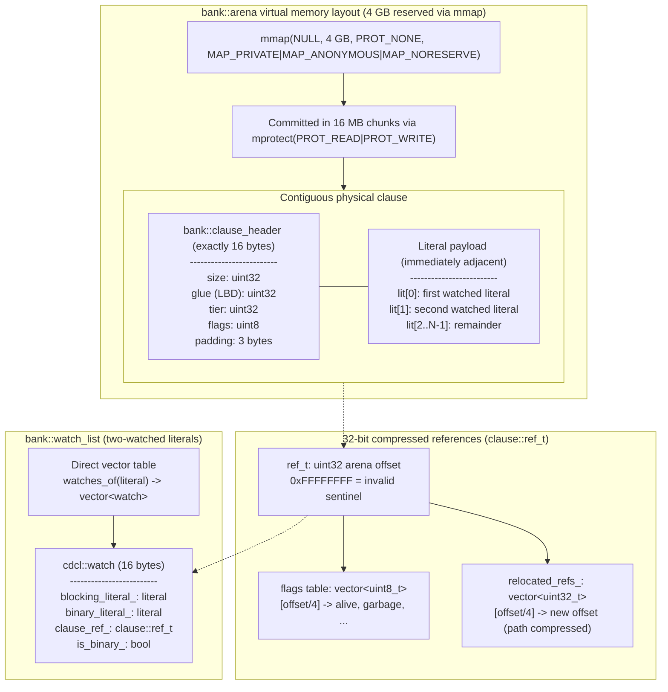

# 3. Memory Architecture and Physical Storage

*Part of the [KMX SAT Solver technical reference](README.md).*

The memory subsystem is designed around **zero reallocation pauses, constant-time reference
dereferencing, and spatial cache locality**.



## 3.1 Virtual memory arena: `bank::arena`

Defined in [arena.hpp](../../source/library/inc/kmx/sat/cdcl/bank/arena.hpp).

- **Virtual reservation.** On Linux, `byte_storage` reserves 2^32 bytes (4 GB) of address space upfront:

  ```cpp
  ::mmap(nullptr, std::size_t {1} << 32u, PROT_NONE,
         MAP_PRIVATE | MAP_ANONYMOUS | MAP_NORESERVE, -1, 0);
  ```

  The reservation costs no physical RAM until pages are touched. On non-Linux platforms, and if the
  `mmap` fails, the class falls back to a `std::pmr` vector, so behaviour degrades to an ordinary growable
  buffer rather than breaking.
- **Chunked commit.** Growth commits in 16 MB chunks (`commit_chunk_size_`) via
  `::mprotect(..., PROT_READ | PROT_WRITE)`. Shrinking just lowers `size_`; committed pages are retained.
- **Fixed base pointer.** Because the range is reserved once, the arena never relocates its base. There
  are no reallocations, no fragmentation spikes, and no pointer invalidation during routine allocation.

## 3.2 Clause representation: one sixteen-byte header

The physical record stored in the arena directly ahead of a clause's literals is sixteen bytes, and it is the
**only** per-clause metadata in the solver: glue, usage, activity, tier and every flag live here, so neither
reduction nor analysis consults a side table.

```cpp
struct clause_header final {
    std::uint32_t size {};       // number of literals
    std::uint32_t glue {};       // literal blocks distance (LBD)
    float         activity {};   // conflict-participation score used as a reduction tie-breaker
    std::uint8_t  flags {};      // redundant(1) garbage(2) reason(4) shrunken(8) tracked(16) alive(32)
    std::uint8_t  used {};       // saturating count of conflicts the clause was resolved in
    std::uint8_t  tier {};       // retention tier (0 = core, 1 = default, 2 = lowest)
    std::uint8_t  reserved {};
};
static_assert(sizeof(clause_header) == 16u);
```

Literals follow the header directly: `lit[0]` and `lit[1]` are the watched pair, `lit[2..N-1]` the
remainder. Clause metadata and both watched literals therefore land in the **same 64-byte cache line** for
clauses of any length. Liveness is the `alive` bit: destroying a clause clears it in place, and there is no
separate flag table to keep in sync.

`clause::header` in [clause/header.hpp](../../source/library/inc/kmx/sat/cdcl/clause/header.hpp) is a logical
value type used by tests and a few passes; it is not what the arena stores.

## 3.3 Compressed references: `clause::ref_t`

[ref_t.hpp](../../source/library/inc/kmx/sat/cdcl/clause/ref_t.hpp) defines a clause reference as a 32-bit
unsigned byte offset into the arena, with `0xFFFFFFFF` as the invalid sentinel. Offsets are four-byte
aligned, so the two low bits of a reference are free — the watch entry uses one of them.

Garbage collection is **in-place compaction** (`clause::database::compact`, [§5.4](05-branching-and-scheduling.md#54-database-reduction-controllerreduce)):
live clauses slide towards the arena base in offset order, the arena is cut after the last one, and the
caller is told every `(old, new)` pair so it can rewrite watches, reasons and unit references through a
dense forwarding table. Nothing is left to resolve afterwards. The older evacuation API
(`storage::relocate_clause` with a redirect table and `resolve_ref`) still exists for the unwired
`garbage_collector`/`compaction_service` drivers and their tests; on the shipped path the redirect table stays
empty and `resolve_ref` is the identity behind one predictable branch.

> A `ref_t` is only meaningful relative to the arena generation that produced it. The search holds none
> across a compaction: every reference it keeps (watches, reasons, units) is rewritten by `collect_garbage`.

## 3.4 Watch entries: `cdcl::watch`

[watch.hpp](../../source/library/inc/kmx/sat/cdcl/watch.hpp). A watch entry is **eight bytes**: the blocking
literal and the clause reference, with the binary flag folded into the reference's low bit.

```cpp
class watch final {
    literal        blocking_;     // literal tested before the clause is fetched
    std::uint32_t  tagged_ref_;   // arena offset | binary flag (bit 0)
};
static_assert(sizeof(watch) == 8u);
```

For a binary clause the blocking literal *is* the other literal, so `binary_literal()` and
`blocking_literal()` name the same field and a binary entry never requires the clause body. The previous
layout carried a separate binary literal and a `bool` in sixteen bytes; halving the entry halves the bytes
the propagation loop streams per visit, which is the loop's dominant cost. Two entries compare equal when
they name the same clause.

## 3.5 Clause database and three-tier management

[clause/database.hpp](../../source/library/inc/kmx/sat/cdcl/clause/database.hpp) holds the logical view over
arena storage: the two reference vectors (irredundant and redundant), the garbage count, and the operations
that read or update a clause's header. Clauses split into:

- **Irredundant (original).** From the problem instance or from a sound preprocessing transformation.
  Never removed by CDCL reduction.
- **Redundant (learned).** Derived by conflict analysis, and classified into three tiers.

A learned clause enters its tier from its glue at creation and `controller::reduce::update_tiers` recomputes
membership from the *current* glue on every reduction pass:

| Tier | Condition | Policy |
| :--- | :--- | :--- |
| `0` (core) | `glue <= 2` | Never selected for reduction |
| `1` (`default_tier`) | `glue <= 6` | Kept while usage or activity justifies it |
| `2` (`lowest_tier`) | higher glue | The reduction target |

Two invariants protect the trail. A clause flagged as an active reason is never flushed, whatever a pass
says (`flush_satisfied` clears its garbage mark instead), and the search flags every trail reason before
reduction or inprocessing runs and clears the flags afterwards — the `protect_reasons` idiom of CaDiCaL,
done once per pass rather than once per propagation.

## 3.6 Memory governor

[memory_governor.hpp](../../source/library/inc/kmx/sat/cdcl/memory_governor.hpp) tracks usage against optional
soft and hard ceilings registered through `register_budget(soft, hard)`, and drives a two-stage
escalation ladder polled by `controller::reduce` and `scheduler::inprocess`:

- **Soft breach** — out-of-band reduction, more aggressive flushing, and memory-heavy inprocessing passes
  (`vivifier`, `congruence`) skipped for the rest of the epoch.
- **Hard breach** — learned-clause growth pauses; if it cannot be resolved by shedding, the episode ends
  with `status::terminated`.

---

[← 2. Public API and External Integration](02-public-api.md) · [Index](README.md) · [4. CDCL Hot Loop and Search Engine →](04-cdcl-hot-loop.md)
