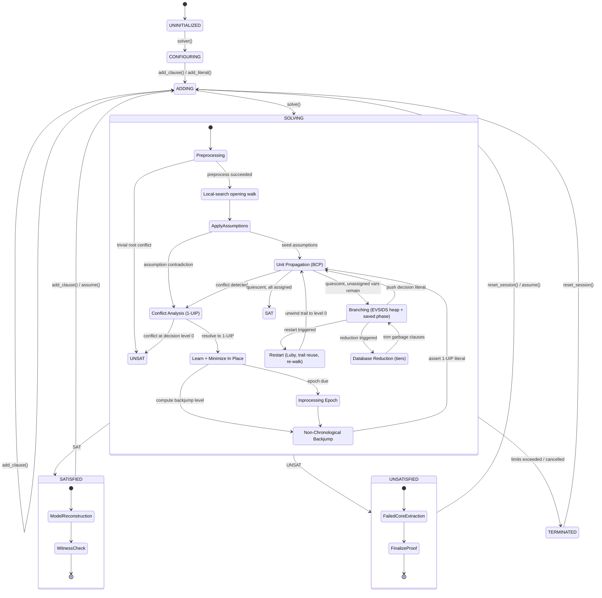

# 4. CDCL Hot Loop and Search Engine

*Part of the [KMX SAT Solver technical reference](README.md).*

## 4.1 Search lifecycle

Inprocessing runs at the root only: `run_inprocess_if_due()` is called right after a restart, with every
trail reason protected, and the watch lists are rebuilt and the root trail re-propagated afterwards.

## 4.2 Two-watched-literal propagation

The BCP loop is `solver_core::propagate` in
[solver_core.hpp](../../source/library/inc/kmx/sat/cdcl/solver_core.hpp). It reads the search state the way it is
laid out: assignment values are indexed **by literal** (`values_[lit] > 0` is "true", `values_[¬lit]` is
its negation, so testing a literal is one signed byte load with no branch on polarity), levels, reasons and
trail positions by variable, and the trail is a flat vector with a control stack recording where each
decision level starts. `propagated_` is the trail index of the next literal to propagate.

For each trail literal `l`, the list of clauses watching `¬l` is compacted in place with a read and a write
pointer:

1. **Blocking literal satisfied** — the entry is kept untouched; nothing else is read. This is the majority
   of visits.
2. **Binary entry** — decided from the entry alone: the blocking literal is the other literal, so it is
   either assigned with the binary clause as reason or, if false, the clause is the conflict.
3. **Otherwise** the clause is fetched. The other watched literal is `lit[0] ^ lit[1] ^ ¬l` (the watched
   pair is always the first two literals), and if it is true the entry's blocking literal is updated. A
   replacement is searched from `lit[2]` on; if found, the watch moves to it (`push_watch` on the
   replacement's list, no deduplication scan) and the entry is dropped here. With no replacement the clause
   is unit — the other literal is assigned with this clause as reason — or, if that literal is false,
   the conflict.

The loop never tests clause liveness: every path that deletes a clause rewrites the watch lists before
propagation resumes (reduction through `collect_garbage`, inprocessing through a full rebuild). It never
marks reasons or bumps usage counters either; both happen once per conflict or once per reduction. On a
`uuf250` solve the loop is about 55% of executed instructions at roughly 40 instructions per watch visit.

Unit clauses are assigned once at level 0 when the episode starts (`assign_root_units`) and stay on the trail
for the whole episode; restarts and backjumps never unassign level 0.

## 4.3 Conflict analysis and learning

`solver_core::analyze_conflict` is a single-pass first-UIP resolution over the implication graph, with no
callbacks, copies or hash containers on the way:

1. Starting from the conflicting clause, every literal not yet `seen` is marked; literals at level 0 are
   skipped (they can never be falsified again), literals below the current level are collected into the
   learned clause, and literals at the current level are counted as `open`.
2. The trail is walked backwards to the most recent seen literal of the current level; that literal's reason
   is resolved next. When `open` drops to one, the remaining literal is the first UIP and its negation
   becomes `learned[0]`.
3. Every clause resolved has its `used` counter and activity bumped in the header.
4. After minimization ([§4.4](#44-clause-minimization)) the glue is the number of distinct levels among the
   learned literals, counted with a level stamp array, and the literal of highest level after the UIP is
   moved to `learned[1]` so that the two watches sit on the two highest-level literals.
5. Every analysed variable is bumped in the EVSIDS heap and the heap increment decays.

`learn_clause` then backjumps to the level of `learned[1]` (0 for a unit), stores the clause **once**,
already minimized, attaches its watches, asserts `learned[0]` with the clause as reason, and reports the
derivation to `proof_manager`. When a proof consumer is attached the antecedent chain is assembled in LRAT
order — root-level unit derivations, then the reasons justifying minimized literals, then the resolved
reasons in trail order and the conflict last — and it is not assembled at all otherwise.

Two cases short-circuit without learning: a conflict at level 0 refutes the formula, and a falsified
assumption ends the episode with its core ([§7.4](07-incremental-solving.md#74-failed-core-extraction)). Both are counted as one
conflict, so limits and statistics treat them like any other.

## 4.4 Clause minimization

A fresh 1-UIP clause usually carries literals implied by other literals of the same clause.
`solver_core::minimize_literal` is the recursive test of CaDiCaL's `minimize_literal`: a literal is
redundant when every literal of its reason is in the clause, fixed at the root, or recursively redundant.
Three marks per variable — `keep` (decided to stay), `removable` (proved redundant), `poison` (proved
not) — make each variable's answer reusable within the clause, and two early rejections prune the recursion:
a literal that is the only one of its level in the clause, or the earliest one of its level on the trail,
cannot be implied by the others. Recursion depth is bounded at 1,000.

Tail literals are examined in trail order so that earlier decisions feed later ones, the clause is truncated
in its scratch vector before it is ever written to the arena, and all marks are cleared through the lists of
touched variables. No allocation, no hashing, nothing retained per clause.

## 4.5 Backjumping, restarts and trail reuse

`backtrack(level)` unassigns every trail literal above the target level's start (recorded in the control
stack), pushes each variable back into the branching heap if it is not already there, truncates the trail
and the control stack, and rewinds the propagation index. Levels and reasons are not cleared: they are only
meaningful for assigned variables.

A restart backtracks to the level returned by trail reuse: starting above the assumption levels, it keeps
every decision level whose decision variable outranks the heap's next candidate (`restart` in
`solver_core.hpp`, CaDiCaL's `reuse_trail`). A restart is only performed once a conflict has been learned
since the previous one; otherwise the pending restart is discharged without unwinding.

---

[← 3. Memory Architecture and Physical Storage](03-memory-architecture.md) · [Index](README.md) · [5. Branching Heuristics and Adaptive Scheduling →](05-branching-and-scheduling.md)
