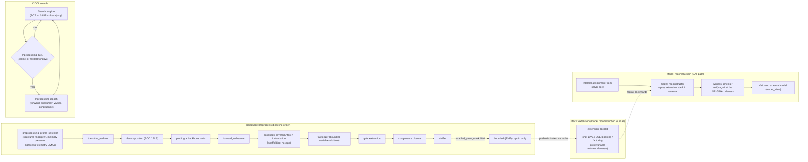

# 6. Simplification: Preprocessing and Inprocessing

*Part of the [KMX SAT Solver technical reference](README.md).*

Simplification rewrites the formula into an equisatisfiable one that is faster to solve, split between
**initial preprocessing** ([scheduler::preprocess](../../source/library/inc/kmx/sat/simplify/scheduler/preprocess.hpp))
and **inprocessing epochs**
([scheduler::inprocess](../../source/library/inc/kmx/sat/simplify/scheduler/inprocess.hpp)).

## 6.1 Simplification pass inventory

[`simplify::pass_id`](../../source/library/inc/kmx/sat/simplify/pass_id.hpp) enumerates fourteen passes. The
enum ordinal *is* the bit position in `solve_request::enabled_pass_mask`.

| Bit | `pass_id` | In default set | Wired to the clause database | Status |
| ---: | :--- | :---: | :---: | :--- |
| 0 | `transitive_reducer` | yes | yes | Working — prunes redundant binary implication edges; effort-bounded, and a removed clause never justifies another removal (that was a soundness defect, see [§12](12-known-limitations.md#12-known-limitations-and-correctness-caveats)) |
| 1 | `decomposition` | **no** | via substitutor | Working in isolation but **off by default**: `equivalence_substitutor` merges variables without polarity and records no witness for model reconstruction ([§12](12-known-limitations.md#12-known-limitations-and-correctness-caveats)) |
| 2 | `probing` | yes | yes | Working — failed-literal probing feeding `extractor::backbone` |
| 3 | `forward_subsumer` | yes | yes | Working — subsumption and self-subsuming resolution |
| 4 | `blocked` | yes | **no** | **Scaffolding.** `run()` increments a counter; `is_blocked_on` returns `true` unconditionally; `emit_extension_record()` is empty |
| 5 | `covered` | yes | **no** | **Scaffolding.** `run()` sets a counter to 1 |
| 6 | `bounded` | **no** | yes | Working but opt-in; see [§6.5](#65-bounded-variable-elimination-and-why-it-is-off-by-default) |
| 7 | `fast` | yes | **no** | **Scaffolding.** Scores only variable 1; its embedded `bounded` instance has no database |
| 8 | `instantiation` | yes | **no** | **Scaffolding.** Every method sets a counter |
| 9 | `factorizer` | yes | **no** | Working — bounded variable addition: a rectangle of clauses (l ∨ d) for l ∈ L, d ∈ D becomes (¬x ∨ l), (x ∨ d) with a fresh x; the group L is recorded on the extension stack and x is dropped from external models. Skipped while a proof consumer is attached (the added clauses are RAT steps the LRAT checkers cannot take). `hole9`: 18,608 conflicts instead of 1,000,625; `hole10` solved in 1.1 s instead of not at all |
| 10 | `gate` | yes | via congruence | Working — AND/XOR/ITE/definition gate extraction |
| 11 | `congruence` | **no** | yes | Working in isolation but **off by default** in both schedulers, for the same substitutor defect as `decomposition` |
| 12 | `vivifier` | yes | yes | Working — clause vivification by trial propagation |
| 13 | `sweep` | **no** | **no** | **Scaffolding.** The "kitten" micro-solver is not implemented |

The scaffolding passes are harmless — they cannot corrupt the formula, because they never touch it — but
they cost a dispatch and a summary record each, and their counters must not be read as evidence that
anything was simplified. `preprocess::attach_clause_database` in
[preprocess.cpp](../../source/library/src/kmx/sat/simplify/scheduler/preprocess.cpp) is the definitive list of
which passes have a formula to work on.

Useful mask values:

| Mask | Meaning |
| ---: | :--- |
| `0` | Scheduler default (all baseline passes) |
| `8127` | `baseline_pass_mask()` — bits 0–12 except `bounded` |
| `8191` | `baseline_pass_mask_with_variable_elimination()` — baseline plus `bounded` |
| `64` | `bounded` only (the reproduction case for the BVE defect) |

## 6.2 Preprocessing pipeline

Two gates can skip a pass before it runs: `preprocessing_profile_selector` (structural and memory-pressure
based) and `is_proof_format_compatible`, which suppresses `gate` and `congruence` when the active proof
format cannot express them. Each pass reports a `pass_summary` recording whether it executed, which gate
skipped it, and the clause count before and after.

## 6.3 Inprocessing epochs

The inprocess scheduler runs a much smaller set — **`forward_subsumer`, `vivifier`** by default, `congruence`
by explicit enablement — on a dual trigger:

| Parameter | Default | Cap |
| :--- | ---: | ---: |
| Conflict trigger window (`inprocess_conflict_window`) | 2,000 conflicts | 2^20 |
| Restart trigger window | 512 restarts | 2^16 |

An epoch is due when either counter passes its next trigger. Windows are **adaptive**: an unproductive
epoch doubles the cooldown (up to the caps), so a formula that stops yielding to simplification stops
paying for it. Under a `memory_governor` soft breach, the memory-heavy passes are skipped.

Epochs run **at the root only**: the search checks the scheduler right after a restart, backtracks to level
0, flags every trail reason (a flagged clause is never flushed, [§3.5](03-memory-architecture.md#35-clause-database-and-three-tier-management)),
runs the epoch, and then rebuilds the watch lists and re-propagates the root trail. On random 3-SAT the
epochs neither help nor hurt measurably; the window option exists to switch them off for experiments.

## 6.4 The implemented passes

**Forward subsumption and self-subsuming resolution**
([forward_subsumer.hpp](../../source/library/inc/kmx/sat/simplify/forward_subsumer.hpp)).
C₁ subsumes C₂ when C₁ ⊆ C₂, so C₂ is deleted. If C₁ contains ¬l and C₂ contains l with
C₁ \ {¬l} ⊆ C₂ \ {l}, then C₂ is *strengthened* by removing l.

- **Permanence is inherited.** When a learned clause subsumes an original one, the learned clause is promoted
  to irredundant before the original is deleted; otherwise a later reduction could remove the learned clause
  and leave the formula weaker than the input.
- **64-bit signatures.** Each clause gets a hash bitmask, `sig(C) = ⋁_{l ∈ C} (1ULL << (hash(l) mod 64))`.
  Before any subset test, the engine checks `(sig(C₁) & ~sig(C₂)) == 0`; a non-zero result disproves
  C₁ ⊆ C₂ in a single register instruction.
- **Rarest-occurrence traversal.** Any clause subsumed by C₁ must contain every literal of C₁, so scanning
  the occurrence list of C₁'s *rarest* literal is both complete and dramatically cheaper than scanning all
  of them.

**Transitive reduction and equivalent-literal substitution.** Binary clauses form a directed implication
graph (¬a ∨ b ⟺ a ⟹ b). `transitive_reducer` prunes an edge a ⟹ c that is already implied by
a ⟹ b ⟹ c. `engine::decomposition` runs SCC over the same graph: a strongly connected component is a set
of equivalent literals, and `equivalence_substitutor` rewrites clauses, watch lists, and the external
variable mapping to a single representative.

**Root propagation and backbone extraction.** `engine::probing` (the name predates its current form) closes
the formula under its unit clauses: every clause that becomes unit once the known units falsify its other
literals is shrunk to that literal in place, and the closure continues to a fixpoint. It runs in time linear
in the formula, through occurrence lists and per-clause unassigned counts; the earlier formulation rescanned
every clause per derived unit through a hash map and took 9.6 s on `bmc-ibm-12`. `extractor::backbone`
confirms each derived literal against the unit clauses and emits a unit for those not yet stated, answering
its membership and unit-clause queries from per-literal mark tables built once per run rather than by
scanning the database per candidate.

**Gate extraction and congruence.** `extractor::gate` recognizes AND, XOR, ITE, and definition gates in
the clause set. `engine::congruence` closes over the extracted gates, derives literal equivalences from
structurally identical gates, and applies them through `equivalence_substitutor`.

**Vivification.** `vivifier` re-propagates each candidate clause's literals under trial assignments,
shortening the clause wherever propagation shows a literal to be unnecessary.

## 6.5 Bounded variable elimination, and why it is off by default

[eliminator/variable/bounded.hpp](../../source/library/inc/kmx/sat/simplify/eliminator/variable/bounded.hpp)
implements standard BVE: for variable *v*, resolve every clause containing *v* against every clause
containing ¬*v*; if the number of non-tautological resolvents does not exceed the number of original
clauses mentioning *v*, eliminate *v* and journal the removed clauses on `stack::extension`.

It works, it is gated by a satisfiability-preservation and model-reconstruction property test
(`bounded_elimination_test`), and it is the single biggest remaining performance opportunity — enabling it
takes a 1,500-variable Tseitin XOR chain from 0.16 s to 0.01 s, exactly the auxiliary-variable collapse
that structured instances need.

**It is nevertheless excluded from `baseline_passes`,** because two interactions are unresolved:

1. **Incremental use.** Eliminating a variable discards the clauses that constrained it. A clause added
   over that variable after a solve has nothing left to contradict it, so the next episode answers
   satisfiable on an unsatisfiable formula. Fixing this needs the eliminated clauses restored when a later
   clause mentions the variable — not implemented. Caught by `long_incremental_session_test` and
   `solver_facade_test`.
2. **Larger formulas.** With `bounded` as the only enabled pass (`--enabled-pass-mask 64`), an
   11-pigeon/10-hole pigeonhole instance (110 variables, 561 clauses) is reported satisfiable. The same
   family is correct at 9 holes and below, so the defect is size- or count-dependent.

Three earlier defects in the same pass were found and fixed, and they describe the shape of what may
remain: assumption variables were being eliminated (fixed by `set_frozen_variables`, populated from
`solve_request::assumptions`); the reconstruction witness stored clauses of both polarities and flipped
per clause instead of storing one polarity; and `find_max_variable` scanned the database *after*
preprocessing, so eliminated variables fell out of the model's domain.

Callers that state the entire problem before a single `solve` and never add a clause afterwards can opt
in through `solve_request::enabled_pass_mask = baseline_pass_mask_with_variable_elimination()` (8191).
Keep model verification on when you do.

> `benchmarks/differential_campaign.py` does **not** catch either remaining defect — it passed 300/300
> while both were live. Its ladder tops out around 40 variables and it never adds clauses after a solve.
> The CLI's model verifier is what catches them, which is why that check exists.

## 6.6 Model reconstruction and witness verification

When the core satisfies the *simplified* formula,
[model_reconstructor.hpp](../../source/library/inc/kmx/sat/cdcl/model_reconstructor.hpp) replays
`stack::extension` in **reverse chronological order**, assigning each eliminated variable a value that
satisfies its recorded witness clause. When the stack is empty — the default, since no eliminating pass is
enabled — this is an identity pass.

> **Independent verification lives in the CLI, not the library.** `cdcl::witness_checker` exists and is
> named in `model_reconstructor`'s documentation as "the fuller independent check", but it is instantiated
> nowhere. What actually re-checks a model is
> [kmx-sat-main.cpp](../../source/cli/kmx-sat-main.cpp)'s `first_unsatisfied_clause`, evaluating the reported
> model against a retained copy of the parsed DIMACS formula, on by default and disabled with
> `--no-verify`. A library embedder gets no such check for free and should re-verify models itself —
> which is exactly how the outstanding BVE unsoundness was caught.

---

[← 5. Branching Heuristics and Adaptive Scheduling](05-branching-and-scheduling.md) · [Index](README.md) · [7. Incremental Solving and the External Boundary →](07-incremental-solving.md)
