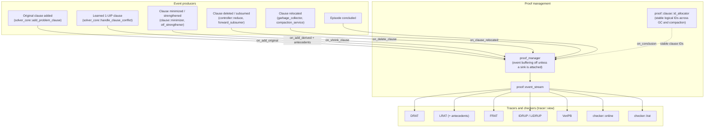

# 8. Proof Pipeline and Verification

*Part of the [KMX SAT Solver technical reference](README.md).*

The six output formats and the two checkers are closed enums in
[proof/format.hpp](../../source/library/inc/kmx/sat/proof/format.hpp) — `format_id` (`drat`, `lrat`, `frat`,
`idrup`, `lidrup`, `veripb`) and `checker_id` (`online`, `lrat`) — so a consumer is selected by identity,
never by a format string.

## 8.1 Physical `ref_t` versus logical `proof::clause::id`

- **`clause::ref_t`** is a transient byte offset into `bank::arena`. It changes whenever a clause moves
  during collection or compaction.
- **`proof::clause::id`** is a monotonically increasing 64-bit identity allocated by
  [id_allocator.hpp](../../source/library/inc/kmx/sat/proof/clause/id_allocator.hpp). On relocation,
  `preserve_on_relocation(old_ref, new_ref)` remaps the binding, so LRAT antecedent chains stay sound
  across memory movement.

Put plainly: `ref_t` says *where a clause currently lives*, `proof::clause::id` says *what a clause
logically is*.

## 8.2 Zero-cost when no proof is attached

With no sink attached, `proof_manager::set_event_buffering(false)` means no event objects and no payload
copies during search, and the antecedent chain of a learned clause is not assembled. Proof identities are
lazy as well: `clause::storage` allocates them at clause creation only while tracking is on, and the core
switches tracking off until `attach_proof_tracer` is called, at which point every existing clause receives
an identity. A proof-free solve therefore performs no hash-table work per learned clause.

## 8.3 Tracer dispatch

`tracer::view` forwards through `std::visit` over
`variant_t = std::variant<drat, lrat, frat, idrup, lidrup, veripb>`. A closed variant compiles to a jump
table with no vtable, no RTTI, and no `dynamic_cast` — which is required here, since the build sets
`cpp.enableRtti: false`. A `tracer::like` concept `static_assert`s each alternative's conformance, so a
malformed tracer fails at compile time rather than at proof-emission time.

## 8.4 Format matrix

| Format | Notes |
| :--- | :--- |
| **DRAT** | Clause additions and deletions with the RUP property |
| **LRAT** | DRAT plus an explicit antecedent-ID resolution chain per derived clause, for linear-time certification (`lrat-check`) |
| **FRAT** | Hints for both original and learned clauses |
| **IDRUP / LIDRUP** | Incremental DRAT with epoch boundaries (`i` records), keeping proofs verifiable across repeated assumption episodes |
| **VeriPB** | Pseudo-Boolean / cutting planes; expresses XOR, cardinality, and gate congruence without clause-level blowup |

`is_proof_format_compatible` in the preprocess scheduler suppresses `gate` and `congruence` when the
active format cannot represent them, rather than emitting an unverifiable proof.

---

[← 7. Incremental Solving and the External Boundary](07-incremental-solving.md) · [Index](README.md) · [9. I/O, Runtime, and Telemetry →](09-io-runtime-telemetry.md)
